<div align="center">

# A R C H I T E C T

### A quiet place to build loud ideas.

Two coordinated VS Code themes, drawn for long sessions and clear thinking.

`WARM CHARCOAL` · `PAPER DAYLIGHT` · `TYPOGRAPHY FIRST`

<br>

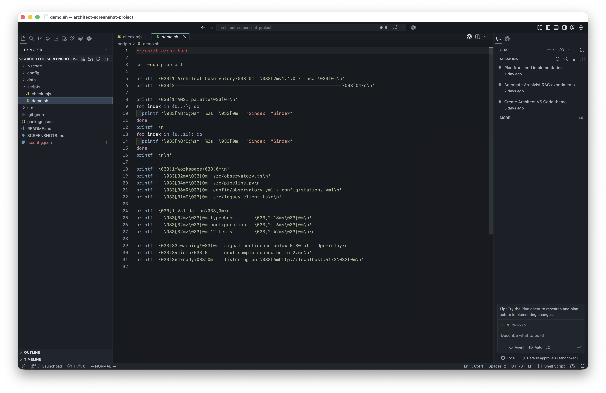
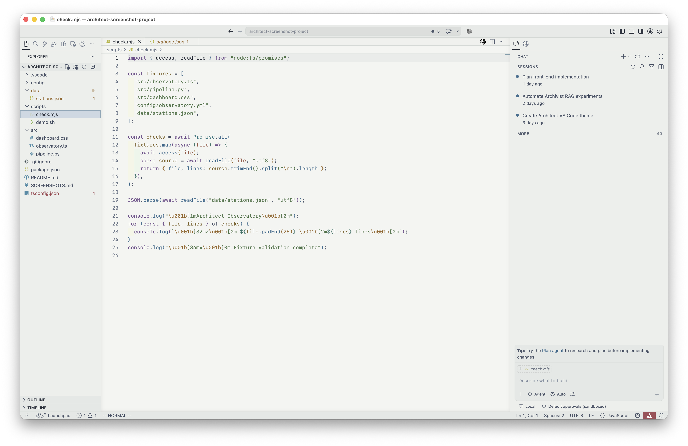

<br><br>

> Structure over spectacle. Signal over decoration.<br>
> Every color earns its place.

</div>

---

## The idea

I built Architect around a simple belief: the editor should disappear just enough for the work to come forward.

It is not neon, nostalgic, or aggressively minimal. It is measured. Warm charcoal and paper-toned canvases establish the room; small changes in surface, type, and color create the hierarchy. Dark and light share the same semantic blueprint, so switching modes changes the atmosphere—not the meaning of your code.

| 01 / FOUNDATION | 02 / STRUCTURE | 03 / DETAIL |
| :--- | :--- | :--- |
| Low-glare canvases made for staying awhile | Consistent semantic roles in both modes | Quiet borders and deliberate surface shifts |

## Two elevations, one blueprint

| Architect Dark | Architect Light |
| :---: | :---: |
| Warm charcoal with quiet blue-gray surfaces | Soft daylight paper with cool stone chrome |
| 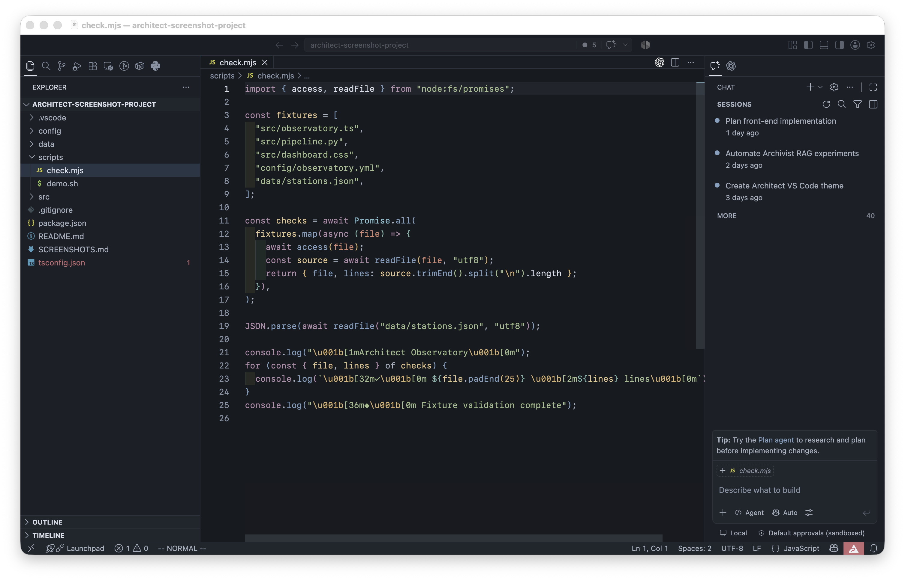 | 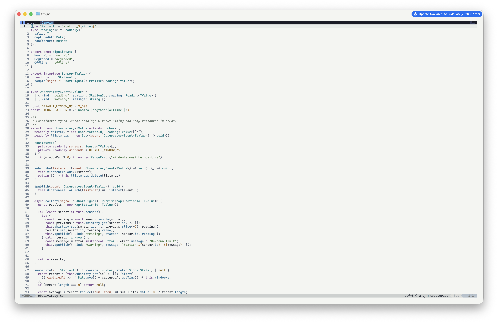 |

## Working drawings

These are not staged color swatches. Architect is shown doing the job: navigating a project, reading dense code, opening suggestions, and moving between languages.

### Night shift

<table>
  <tr>
    <td width="50%"></td>
    <td width="50%">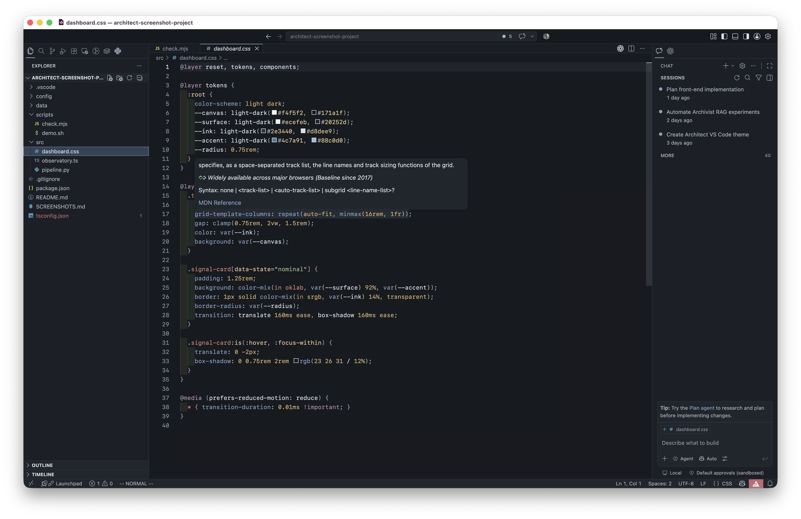</td>
  </tr>
  <tr>
    <td align="center"><sub>Completion without the spotlight</sub></td>
    <td align="center"><sub>Syntax with a measured pulse</sub></td>
  </tr>
  <tr>
    <td width="50%">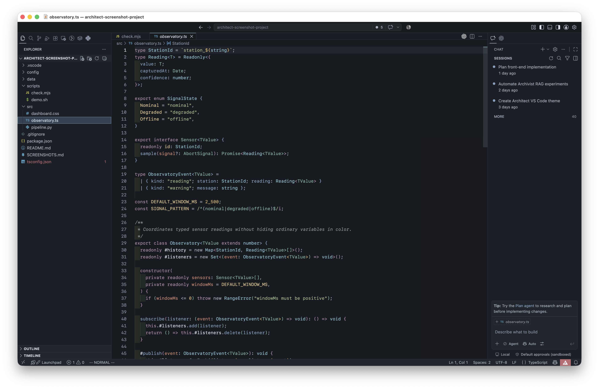</td>
    <td width="50%">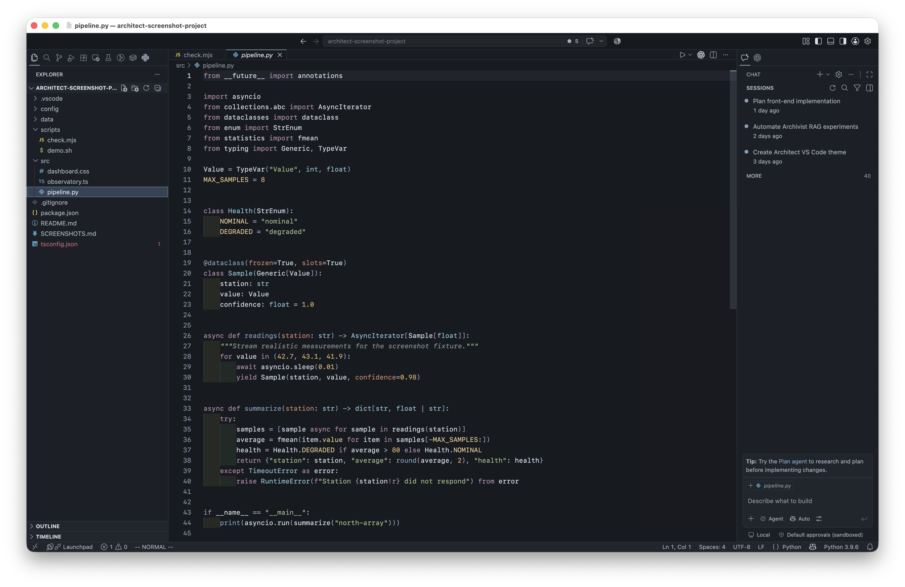</td>
  </tr>
  <tr>
    <td align="center"><sub>Hierarchy across a full file</sub></td>
    <td align="center"><sub>Calm, even at its most compact</sub></td>
  </tr>
</table>

### Day shift

<table>
  <tr>
    <td width="50%">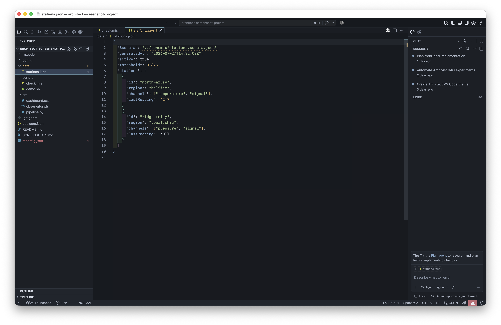</td>
    <td width="50%"></td>
  </tr>
  <tr>
    <td align="center"><sub>Paper, not pure white</sub></td>
    <td align="center"><sub>Cool structure in daylight</sub></td>
  </tr>
  <tr>
    <td width="50%">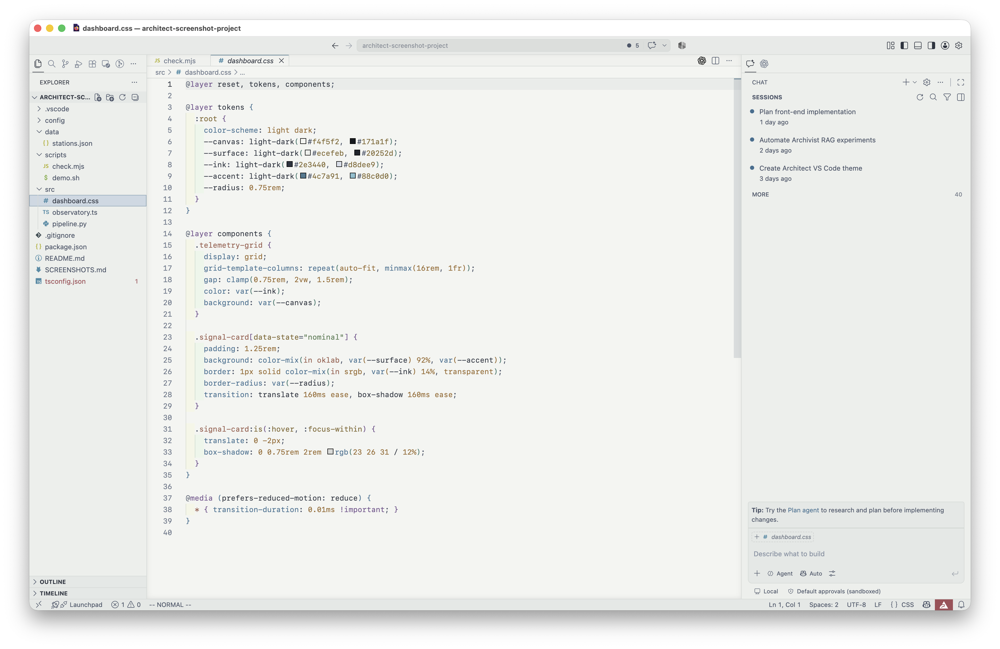</td>
    <td width="50%">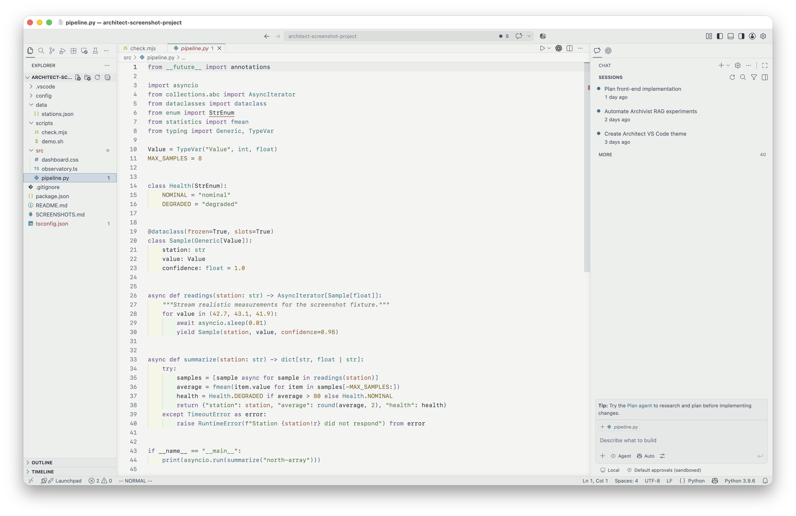</td>
  </tr>
  <tr>
    <td align="center"><sub>Semantic roles stay familiar</sub></td>
    <td align="center"><sub>Detail without visual noise</sub></td>
  </tr>
</table>

<details>
<summary><strong>Open the material study</strong> — palette and token inspection</summary>
<br>
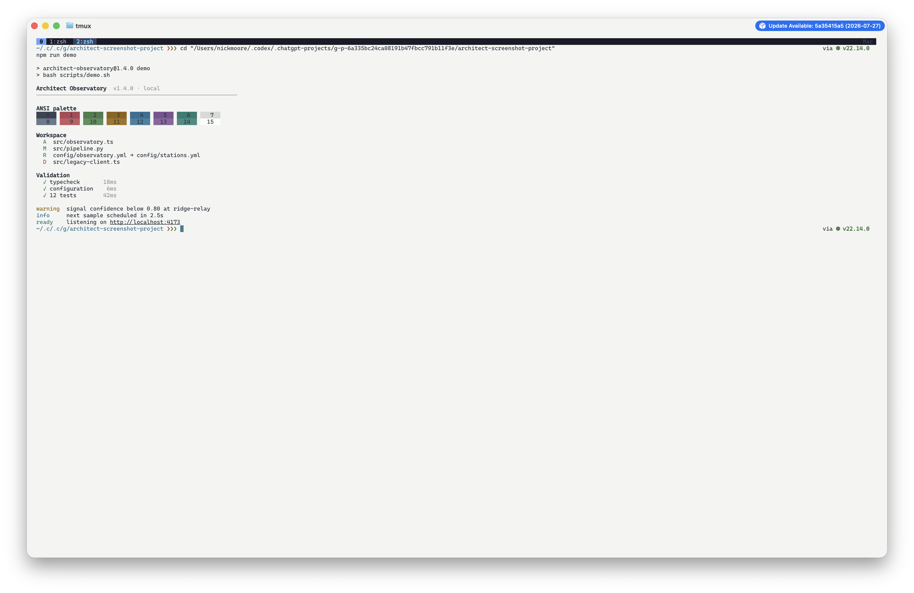
</details>

## Color has a job

Ordinary variables stay close to the editor foreground. Color is reserved for information:

- **Blue / cyan** identifies callable and type-level structure.
- **Sage** belongs to strings and successful states.
- **Violet** marks language keywords without taking over the page.
- **Amber / gold** identifies values, constants, and attributes.
- **Coral / muted red** is used sparingly for tags, conflicts, and errors.

<details>
<summary><strong>View the complete palette specification</strong></summary>
<br>

| Role | Architect Dark | Architect Light |
| --- | --- | --- |
| Editor canvas | `#171A1F` | `#F4F5F2` |
| Side bar | `#1B1F26` | `#ECEFEB` |
| Elevated surface | `#20252D` | `#E4E8E6` |
| Primary text | `#D8DEE9` | `#2E3440` |
| Secondary text | `#A7B0BF` | `#4C566A` |
| Comments | `#899696` | `#68746D` |
| Selection | `#344256` | `#CDD8E3` |
| Accent / cursor | `#88C0D0` | `#4C7A91` |
| Keywords | `#B48EAD` | `#76558F` |
| Functions | `#81A1C1` | `#3E6F91` |
| Types | `#88C0D0` | `#357A83` |
| Strings | `#A3BE8C` | `#547A50` |
| Numbers | `#D9B26F` | `#9A6B2F` |
| Tags / errors | `#D08770` / `#BF6B73` | `#9C5E4D` / `#A24E57` |

</details>

## Move in

### Try it locally

Requirements: [Visual Studio Code](https://code.visualstudio.com/) and Node.js 20 or newer.

```sh
git clone https://github.com/your-user/architect-vscode-theme.git
cd architect-vscode-theme
npm install
code architect-theme.code-workspace
```

Press `F5`, choose **Launch Architect Theme**, then open the color theme picker with `Ctrl+K Ctrl+T` on Windows/Linux or `Cmd+K Cmd+T` on macOS. Select **Architect Dark** or **Architect Light**.

> [!NOTE]
> The `your-user` and `your-publisher-name` values are intentional placeholders. Replace them before publishing.

### Recommended settings

```jsonc
{
  "editor.semanticHighlighting.enabled": true,
  "editor.bracketPairColorization.enabled": true,
  "editor.guides.bracketPairs": "active",
  "editor.guides.highlightActiveIndentation": true,
  "editor.renderWhitespace": "selection"
}
```

## Language coverage

Architect includes broad TextMate and semantic-token coverage for:

`TypeScript` · `JavaScript` · `Python` · `Go` · `Rust` · `HTML` · `XML` · `CSS` · `JSON` · `Markdown` · `YAML` · `Shell` · `Diff`

Languages supplied by extensions inherit the semantic roles and common TextMate scopes.

## The workshop

Theme sources are generated from the centralized role palette in `scripts/generate-themes.mjs`. Generated JSON in `themes/` is checked into source control, keeping the extension fully declarative at runtime.

```sh
npm run generate    # rebuild both themes from the shared palette
npm run validate    # check structure, coverage, colors, and contrast
npm run package     # create a local VSIX without publishing
```

Install the resulting archive with:

```sh
code --install-extension architect-vscode-theme-0.1.0.vsix
```

<details>
<summary><strong>Theme-specific workbench customization</strong></summary>
<br>

```jsonc
{
  "workbench.colorCustomizations": {
    "[Architect Dark]": {
      "editor.background": "#15181D",
      "statusBar.background": "#20252D"
    },
    "[Architect Light]": {
      "editor.background": "#F7F7F4",
      "statusBar.background": "#E4E8E6"
    }
  }
}
```

</details>

<details>
<summary><strong>TextMate token customization</strong></summary>
<br>

```jsonc
{
  "editor.tokenColorCustomizations": {
    "[Architect Dark]": {
      "comments": {
        "foreground": "#93A0A0",
        "fontStyle": ""
      },
      "textMateRules": [
        {
          "scope": "entity.name.function",
          "settings": {
            "foreground": "#8AACC9"
          }
        }
      ]
    }
  }
}
```

</details>

## Fine print

- Syntax precision depends on the grammar and semantic-token provider installed for a language.
- Embedded languages can inherit scopes from their host grammar and may not match every specialized extension.
- Terminal applications that emit their own 24-bit colors bypass the ANSI palette.

Contributions are welcome. Please include a focused before/after screenshot and a small fixture for scope changes. Keep new colors tied to an existing semantic role where possible, and run `npm run validate` and `npm run package` before opening a pull request.

---

<div align="center">

### Make the room quiet. Let the work speak.

Architect is released under the [MIT License](LICENSE).

</div>
